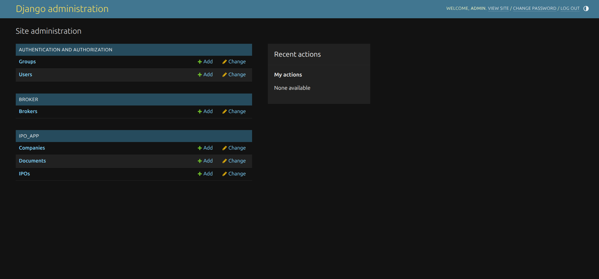
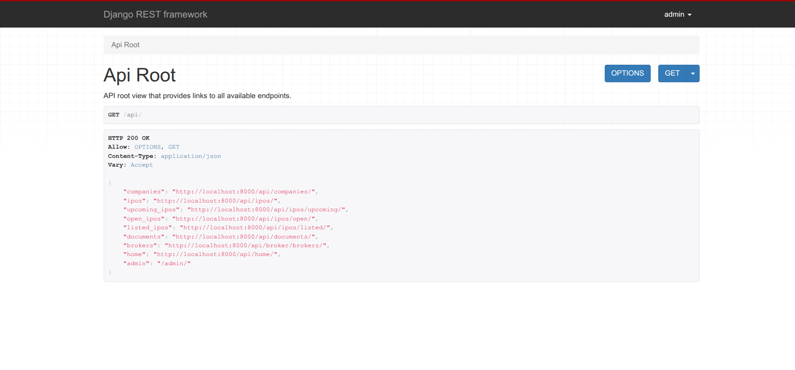
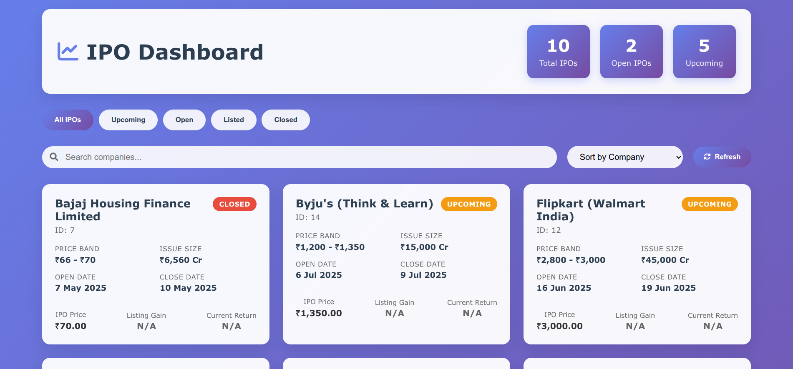
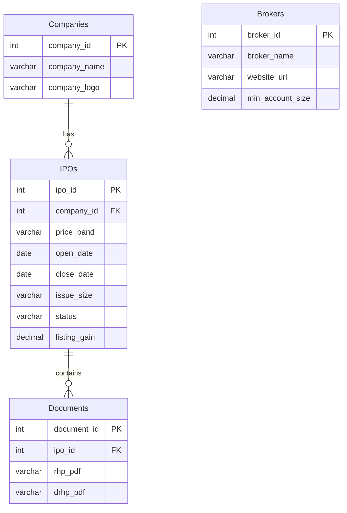

<div id="top"></div>

# IPO Web Application

[](#)
[](https://python.org)
[](https://reactjs.org)
[](https://djangoproject.com)

A comprehensive web application for managing and displaying IPO data, featuring a modern React.js frontend and a robust Django REST API backend.

## 🖼️ Application Screenshots

<div align="center">
  <table>
    <tr>
      <td align="center">
        <br>
        <b>Admin Panel</b><br>
        <i>Comprehensive admin interface for managing IPOs, companies, and broker data</i>
      </td>
      <td align="center">
        <br>
        <b>Backend API</b><br>
        <i>RESTful API endpoints with detailed documentation and testing interface</i>
      </td>
      <td align="center">
        <br>
        <b>Frontend Interface</b><br>
        <i>Modern, responsive React.js frontend with real-time IPO tracking</i>
      </td>
    </tr>
  </table>
</div>

## 📋 Table of Contents

- [Features](#-features)
- [Project Architecture](#-project-architecture)
- [Quick Start](#-quick-start)
  - [Backend Setup](#backend-setup)
- [API Documentation](#-api-documentation)
  - [Core Endpoints](#core-endpoints)
  - [Specialized IPO Endpoints](#specialized-ipo-endpoints)
- [Database Schema](#-database-schema)
  - [Entity Relationship Overview](#entity-relationship-overview)
  - [Detailed Schema](#detailed-schema)
- [Deployment](#-deployment)

## 🌟 Features

- **Real-time IPO Tracking**: Monitor upcoming, open, and listed IPOs
- **Company Management**: Comprehensive company profiles with logos and details
- **Document Repository**: Secure storage and access to RHP and DRHP documents
- **Broker Integration**: Detailed broker information with account opening links
- **Admin Dashboard**: Powerful admin interface for data management
- **RESTful API**: Well-documented API endpoints for seamless integration

## 📁 Project Architecture

```
ipo-web-app/
├── backend/                    # Django REST API
├── frontend/                  # Frontend
└── README.md                # Main documentation
```

## 🚀 Quick Start

### Prerequisites

Ensure you have the following installed:

- **Python 3.8+**
- **Node.js 16+**
- **PostgreSQL** (recommended) or SQLite for development

### Backend Setup

1. **Clone the repository**
   ```bash
   git clone https://github.com/vijay-kumar-mahto/ipo-web-app.git
   cd ipo-web-app/backend
   ```

2. **Create and activate virtual environment**
   ```bash
   python -m venv venv
   
   # On Windows
   venv\Scripts\activate
   
   # On macOS/Linux
   source venv/bin/activate
   ```

3. **Install dependencies**
   ```bash
   pip install -r requirements.txt
   ```

4. **Configure environment variables**
   ```bash
   cp .env.example .env
   # Edit .env with your database credentials and settings
   ```

5. **Run database migrations**
   ```bash
   python manage.py makemigrations
   python manage.py migrate
   ```

6. **Create superuser account**
   ```bash
   python manage.py createsuperuser
   ```
   > **Development Credentials:**
   > - Username: `admin`
   > - Password: `admin` (Change in production!)

7. **Start the development server**
   ```bash
   python manage.py runserver
   ```

8. **Access the application**
   - API Base URL: `http://127.0.0.1:8000/api/`
   - Admin Panel: `http://127.0.0.1:8000/admin/`


## 📡 API Documentation

### Base URL
```
http://127.0.0.1:8000/api/
```

### Core Endpoints

| Endpoint | Method | Description |
|----------|--------|-------------|
| `/companies/` | GET, POST | Company management |
| `/ipos/` | GET, POST | IPO operations |
| `/documents/` | GET, POST | Document handling |
| `/broker/brokers/` | GET, POST | Broker information |
| `/home/` | GET | Dashboard data |

### Specialized IPO Endpoints

| Endpoint | Description |
|----------|-------------|
| `/ipos/upcoming/` | Retrieve upcoming IPOs |
| `/ipos/open/` | Get currently open IPOs |
| `/ipos/listed/` | Fetch listed IPOs |

## 🗄️ Database Schema

### Entity Relationship Overview



### Detailed Schema

#### Companies Table
| Field | Type | Constraints | Description |
|-------|------|------------|-------------|
| `company_id` | INT | PK, Auto-Increment | Unique company identifier |
| `company_name` | VARCHAR(255) | NOT NULL | Official company name |
| `company_logo` | VARCHAR(255) | NULL | Logo file path or URL |

#### IPOs Table
| Field | Type | Constraints | Description |
|-------|------|------------|-------------|
| `ipo_id` | INT | PK, Auto-Increment | Unique IPO identifier |
| `company_id` | INT | FK → Companies | Associated company |
| `price_band` | VARCHAR(50) | NULL | IPO price range |
| `open_date` | DATE | NULL | Subscription opening date |
| `close_date` | DATE | NULL | Subscription closing date |
| `issue_size` | VARCHAR(100) | NULL | Total issue size |
| `issue_type` | VARCHAR(50) | NULL | Type of offering |
| `listing_date` | DATE | NULL | Stock exchange listing date |
| `status` | ENUM | NULL | Current IPO status |
| `ipo_price` | DECIMAL(10,2) | NULL | Final IPO price |
| `listing_price` | DECIMAL(10,2) | NULL | Opening listing price |
| `listing_gain` | DECIMAL(5,2) | NULL | Listing day gain percentage |
| `current_market_price` | DECIMAL(10,2) | NULL | Current trading price |
| `current_return` | DECIMAL(5,2) | NULL | Current return percentage |


## 🚀 Deployment

### Production Checklist
- [ ] Set `DEBUG = False` in Django settings
- [ ] Configure production database (PostgreSQL recommended)
- [ ] Set up static file serving
- [ ] Configure CORS settings
- [ ] Set up SSL certificates
- [ ] Configure environment variables
- [ ] Set up monitoring and logging

<div align="center">
  <p>
    <a href="#top">Back to Top ⬆️</a>
  </p>
</div>

